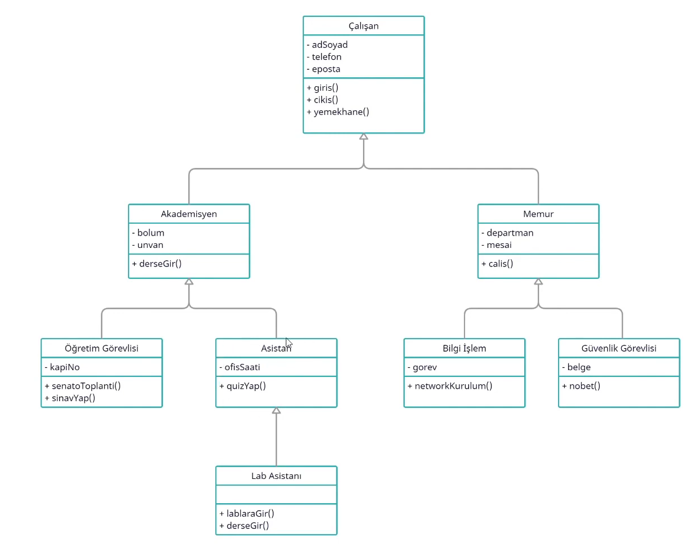

# Üniversite Çalışan Sistemi Uml Class Diagramı

patika.dev  @umithavare

## Kalıtım'da Constructor Zinciri ve Super Anahtar Sözcüğü
Bir sınıfa ait nesne oluşturulurken, o sınıfın bir kurucusunun işletildiğini, kurucunun çalışması tamamlandıktan sonra bellekte artık bir nesnenin oluştuğunu biliyoruz. Kurucuları da nesneleri ilk oluşturuldukları anda anlamlı durumlara taşıyabilmek için kullanıyoruz. Bu durumda, eğer nesnesi oluşturulacak sınıf başka bir sınıfın alt sınıfıysa, önce ataya ait içnesnesinin oluşturulması ve bu nesnenin niteliklerinin ilk değerlerinin verilmesi gerektiğini söyleyebiliriz.

İçiçe nesnelerin oluşabilmesi için nesnelerin içten dışa doğru oluşması gerekir. İç-nesnenin oluşabilmesi için, nesnesi oluşturulacak sınıfa ait kurucu işletilmeye başladığı zaman ilk iş olarak ata sınıfa ait kurucu çağrılır. Eğer ata sınıf da başka bir sınıfın alt sınıfıysa, bu kez o sınıfın kurucusu çağrılır. Kurucu zinciri alt sınıftan ata sınıfa doğru bu şekilde ilerler. En üstte, kalıtım ağacının tepesindeki sınıfın kurucusunun çalışması sonlandıktan sonra sırası ile alt sınıfların kurucularının çalışması sonlanacaktır. Böylece içiçe nesneler sıra ile oluşturularak en son en dıştaki nesne oluşturulmuş olur ve kurucu zinciri tamamlanır.

## Super Kullanımı
Eğer ata sınıfta varsayılan kurucu yoksa ve programcı alt sınıftaki kurucunun içinde ata sınıfın hangi kurucusunun çağrılacağını belirtmezse derleme hatası alınacaktır. Çünkü derleyici aksi belirtilmedikçe ata sınıfın varsayılan kurucusunu çağıran super() kodunu üretecektir. Ata sınıfın hangi kurucusunun çağrılacağı, super anahtar sözcüğü ile birlikte verilen parametrelere göre belirlenir. Nasıl ki new işleci ile birlikte kullandığımız parametreler hangi kurucunun çağrılacağını belirliyorsa, super anahtar sözcüğü ile birlikte kullanılan parametreler de aynı şekilde ata sınıfın hangi kurucusunun işletileceğini belirler.

## Tasarım

## Authors

- [@umithavare](https://www.github.com/umithavare)

