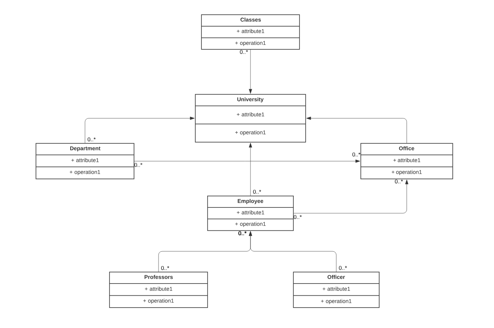

# Üniversite Yönetim Sistemi Uml Class Diagramı

patika.dev  @umithavare

##  Kurallar

- Üniversiteye ait sınıflıklar, çalışma ofisleri ve departmanlar vardır.

- Departmanlara ait ofisler vardır.

- Üniversiteye ait çalışanlar vardır. Bu çalışanlar profesör veya memur olabilir.

- Her çalışan bir ofiste çalışır.

Bu sistemi tasvir eden Class (Sınıf) diyagramını çiziniz.

Not : Sınıflara ait nitelik ve davranışların belirtilmesine gerek yoktur.

## Uml Diagramı

## Authors

- [@umithavare](https://www.github.com/umithavare)

